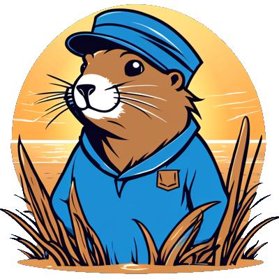

    

    <em>generated using <a href="hotpot.ai">hotpot</a></em>

<h1 align="center">
    Go Kazetenn
</h1>

<h3 align="center">
    kazetenn means journal in brittany
</h3>

<h2>
    Description
</h2>

    A simple GO newsletter, named go-kazetenn, which is set to be operated using cloud computing services such as AWS Lambda, Azure Function, Kubernetes jobs, and more. The term 'Kazetenn' originates from Brittany and translates to 'journal' in English. The goal of the project is to discover the language of go and it's modules.

